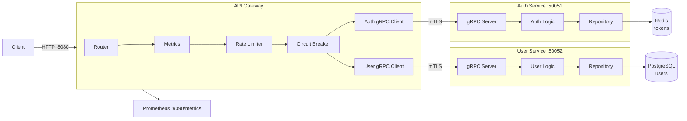

# Restaurant Platform

## Архитектура


## Технологии

 - **Основное**
 - Go 1.25
 - **База данных**
 - Redis
 - PostgreSQL
 - SQLite3 **(deprecated)**
 - **Прочее**
 - JWT
 - bcrypt
 - gRPC + mTLS
 - YAML
 - **Автоматизация**
 - Taskfile
 - Docker

## Тестирование и CI/CD

[](https://github.com/absdekty/restaurant-platform/actions/workflows/ci.yml)

### Запуск тестов

```bash
# Юнит-тесты
go test ./...

# Интеграционные тесты
docker compose up -d
go test ./tests/integration/ -v
```

### Линтер
```bash
golangci-lint run
```

## TaskFile

```bash
# Генерация сертификатов
task gen-certs

# Компиляция proto файлов
task proto SERVICE=auth VERSION=v3

# Запуск всех сервисов (Windows)
task run-all-win

# Запуск определенного сервиса
task run SERVICE=auth

# Сбилдить все микросервисы
task build-all-win

# Запустить сбилженные микросервисы
task run-builded-win

# Тесты
task tests
task test SERVICE=auth

# Очистка данных

# .db .pem .exe
task clean 

# .db
task clean-db

# .pem
task clean-certs

# .exe
task clean-exe
```

## Gateway API Endpoints (:8080)
| Метод | Ручка | Описание |
|-------|-------|----------|
| GET | /health | Жив ли gateway |
| POST | /register | Регистрирует пользователя |
| POST | /login | Авторизовывает пользователя |
| POST | /refresh | Обновляет пару токенов по истечению access токена |
| POST | /logout | Отзывает refresh токен, удаляет куку |

## Prometheus Endpoints (:9090)
| Метод | Ручка | Описание |
|-------|-------|----------|
| GET | /metrics | Показывает метрики |

## Пример пользования

```bash
# Жив ли сервис?
curl localhost:8080/health

# Зарегистрировать нового пользователя
curl -X POST localhost:8080/register \
  -H "Content-Type: application/json" \
  -d '{"Name":"NewUser","Password":"Password"}'

# Залогинить нового пользователя
curl -X POST localhost:8080/login \
  -H "Content-Type: application/json" \
  -d '{"Name":"NewUser","Password":"Password"}' \
  -c cookies.txt

# Обновить пару токенов(по истечению access токена)
curl -X POST localhost:8080/refresh \
  -c cookies.txt \
  -b cookies.txt

# Выйти с сессии (Отзыв токена + удаление куки)
curl -X POST localhost:8080/logout \
  -c cookies.txt \
  -b cookies.txt

# Узнать метрики сервера
curl -X GET localhost:9090/metrics
```

## Установка и запуск
```
# Установка:
git clone https://github.com/absdekty/restaurant-platform.git

# Установка mTLS сертификатов
task gen-certs

# Запуск
docker compose up --build
```

## Конфигурация
```bash
- `configs/config.yaml`— полный список конфигураций
- `configs/config.local.yaml` — для локальной разработки

Так-же есть механизм перетирания, для локального необязательно вставлять все настройки, достаточно лишь указать путь к нужной конфигурации
Так-же можно использовать ENV

Приоритет: ENV > local yaml > yaml
```